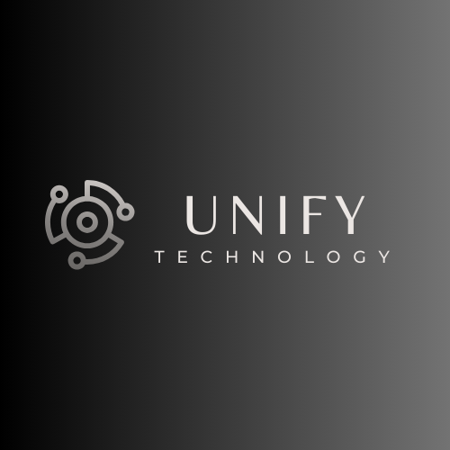
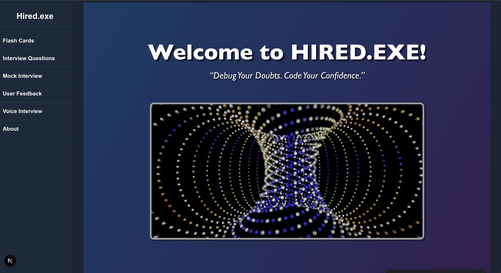
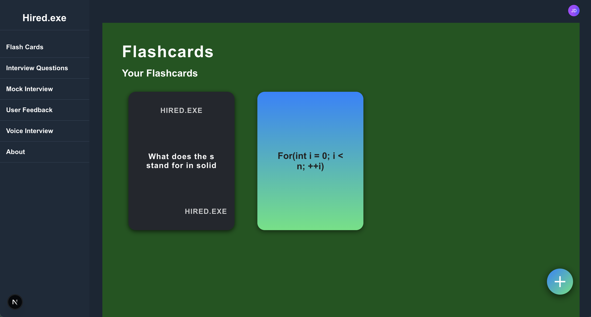
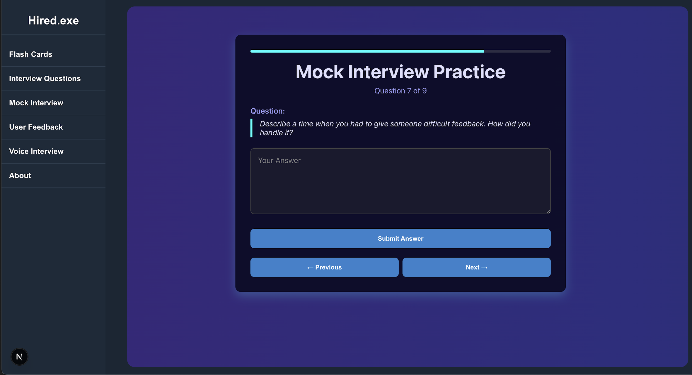
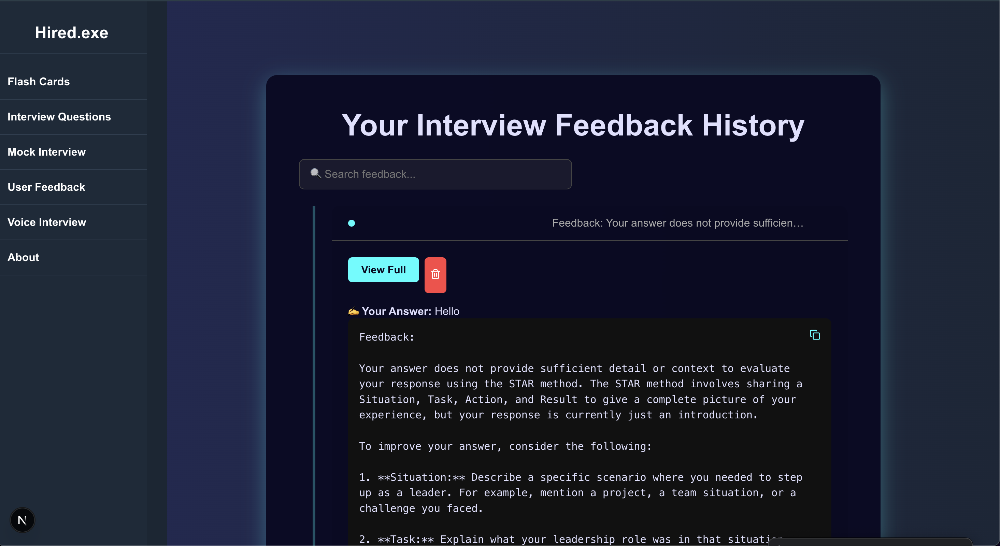

# Decode: Interactive Interview Preparation Platform



[](https://25q1-team2.vercel.app)  
[](https://github.com/code-differently/25q1-team2/actions)  
[](LICENSE)

---

## Table of Contents

- [App Description](#app-description)
- [Demo](#demo)
- [Screenshot Gallery](#screenshot-gallery)
- [Motivation](#motivation)
- [Features](#features)
- [Tech Stack](#tech-stack)
- [Getting Started](#getting-started)
- [Usage](#usage)
- [Testing](#testing)
- [Known Issues](#known-issues)
- [Roadmap & Future Features](#roadmap--future-features)
- [Team UNIFY](#team-unify)
- [Contributing](#contributing)
- [License](#license)
- [Acknowledgements](#acknowledgements)

---

## App Description

Decode (formerly **Hired.exe**) is a web‑based quiz application that empowers aspiring programmers and tech professionals to prepare for technical interviews through randomized question sets and AI‑assisted feedback. Users can also create and study custom flashcards to reinforce key concepts before attempting quizzes—combining active recall with practical application for a well‑rounded prep experience.

## Demo

🔗 Live: [https://25q1-team2.vercel.app](https://25q1-team2.vercel.app)

---

## Screenshot Gallery

<div style="display: flex; flex-wrap: wrap; gap: 1rem; justify-content: center;">

  <div style="text-align: center;">
    
    <p>Landing Page</p>
  </div>

  <div style="text-align: center;">
    
    <p>Flashcards</p>
  </div>

  <div style="text-align: center;">
    
    <p>Mock Interview</p>
  </div>

  <div style="text-align: center;">
    
    <p>Feedback</p>
</div>

  <div style="text-align: center;">
    
    <p>Team Collaboration</p>
  </div>

</div>

## Motivation

Preparing for technical interviews can be overwhelming:

- **Inconsistent practice** leads to conceptual gaps.
- **Lack of feedback** makes it hard to know where you’re weak.
- **Interview nerves** aren’t addressed by textbook studying.

**Decode** bridges these gaps with active‑recall flashcards, realistic text & voice simulations, and structured AI feedback.

---

## Features

- 🔒 Secure auth via [Clerk](https://clerk.com)
- 🃏 Flashcards: create, edit, delete, review
- 💬 Text interviews: random questions + GPT feedback
- 🎙️ Voice interviews: record, Whisper‑transcribe, GPT‑evaluate
- ⭐ STAR‑method scoring & improvement tips
- 📈 Dashboard: track past sessions & feedback

---

## Tech Stack

| Layer          | Tech                          |
| -------------- | ----------------------------- |
| Frontend       | Next.js, React, TypeScript    |
| Styling        | CSS Modules                   |
| Backend        | Next.js API Routes, Node.js   |
| ORM & Database | Prisma, PostgreSQL            |
| Auth           | Clerk                         |
| AI Services    | OpenAI API (ChatGPT, Whisper) |
| Deployment     | Vercel                        |

---

## Getting Started

1. **Clone & install**
   ```bash
   git clone https://github.com/code-differently/25q1-team2.git
   cd 25q1-team2
   npm install
   ```
2. **Configure**
   ```bash
   cp .env.example .env.local
   # Fill in DATABASE_URL, NEXT_PUBLIC_CLERK_*, CLERK_API_KEY & OPENAI_API_KEY
   ```
3. **Database**
   ```bash
   npx prisma migrate dev --name init
   npx prisma generate
   ```
4. **Run**
   - Dev: `npm run dev` → http://localhost:3000
   - Prod: `npm run build && npm start`

---

## Usage

1. Sign up / log in via Clerk
2. **Flashcards**: add & review cards
3. **Mock Interview**: text‑based practice
4. **Voice Interview**: record & get AI feedback
5. **History**: revisit past sessions

---

## Testing

- Unit/Integration: `npm run test`
- E2E (Cypress): `npm run cypress:open`

---

## Known Issues

- [ ] Light/dark mode toggle causes minor layout shifts
- [ ] Feedback containers overflow on narrow screens
- [ ] Voice transcription lags in headless environments

---

## Roadmap & Future Features

- 📊 Admin panel for question management
- 🔔 Email/SMS session reminders
- ⭐ Flashcard scoring & analytics
- 🎮 Interactive mini‑games for concept reinforcement
- 🖼️ Custom user avatars
- 🚀 Webhooks & performance optimizations
- ♿ Accessibility: screen‑reader, high‑contrast, adjustable fonts

---

## Team UNIFY

### Our Mission

> Empower aspiring tech professionals with engaging, AI‑driven practice tools that build confidence and simulate real interview scenarios.

<table>
  <tr>
    <td align="center">
      <br>
      <strong>Karen Alabi</strong><br>Project Manager
    </td>
    <td align="center">
      <br>
      <strong>Justin Eklund</strong><br>QA & Documentation
    </td>
    <td align="center">
      <br>
      <strong>Dylan Lafferty</strong><br>Lead Developer
    </td>
    <td align="center">
      <br>
      <strong>Bryana Singleton‑Barnhart</strong><br>UI/UX Designer
    </td>
    <td align="center">
      <br>
      <strong>Meiko Stephens</strong><br>DevOps Engineer
    </td>
  </tr>
</table>

> _Drop your team headshots into `./assets/images/` with matching filenames._

---

## Contributing

Contributions welcome!

1. Fork → `git checkout -b feature/MyFeature`
2. Commit → `git commit -m "Add feature"`
3. Push → `git push origin feature/MyFeature`
4. Open a PR

---

## License

MIT © UNIFY Team

---

## Acknowledgements

- [Clerk](https://clerk.com) for auth
- [Prisma](https://prisma.io) for ORM
- [OpenAI](https://openai.com) for AI services
