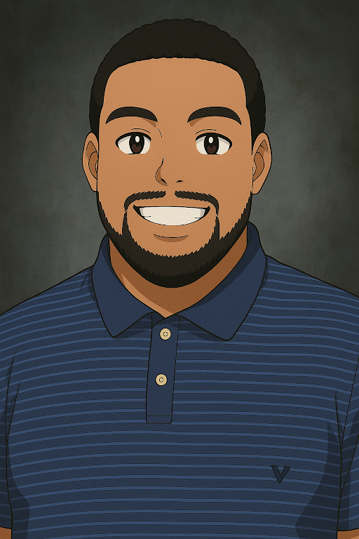

<div align="center">
  
  ## Decode: Interactive Interview Prep Platform  
  *“Debug your doubts. Code your confidence.”*
</div>

[](https://25q1-team2.vercel.app) [](https://github.com/code-differently/25q1-team2/actions) [](LICENSE)

🔗 [Demo](#demo) • 🖼️ [Screens](#screenshot-gallery) • 🚀 [Quick Start](#quick-start) • 👥 [Team](#team-unify)

### App Summary
**Hired.exe** is a web-based quiz application that empowers aspiring programmers and tech professionals to prepare for technical interviews through randomized question sets and AI-assisted feedback. Users can also create and study custom flashcards to reinforce key concepts before attempting quizzes, combining active recall with practical application for a well-rounded prep experience.

**Decode** combines:
- 🃏 Custom flashcards  
- 💬 Text & 🎙️ voice mock interviews  
- ⭐ AI‑driven STAR feedback  

**Tech:** `Next.js` `React` `TS` • `Prisma` `Postgres` • `Clerk` • `OpenAI` • `Vercel`

<details>
<summary>🚀 Quick Start & Installation</summary>

```bash
# Dependencies
npm install

# Run frontend locally
npm run dev

# Launch Prisma Studio for the backend
npm run studio

# Database setup (if needed)
npx prisma migrate dev --name init
npx prisma generate
```
</details>

---

| Landing | Flashcards | Mock Interview |
|:--:|:--:|:--:|
|  |  |  |

---

## 🚧 Known Issues
- Light/dark mode toggle causes minor layout shifts  
- Feedback containers overflow on narrow screens  
- Voice transcription lags in headless environments  

## 🛠️ Roadmap & Future Features
- Admin panel for question management  
- Flashcard scoring & analytics  
- Interactive mini‑games for concept reinforcement  
- Custom user avatars  
- Email/SMS session reminders  
- Webhooks & performance optimizations  
- Accessibility improvements (screen-reader, high-contrast, adjustable fonts)

---

### 👥 Team UNIFY

| Karen Alabi<br/>_PM_ | Dylan Lafferty<br/>_Lead Dev_ | Bryana Singleton‑Barnhart<br/>_UI/UX_ | Meiko Stephens<br/>_DevOps_ | Justin Eklund<br/>_QA_ |
|:--:|:--:|:--:|:--:|:--:|
|  |  |  |  |  |

---
