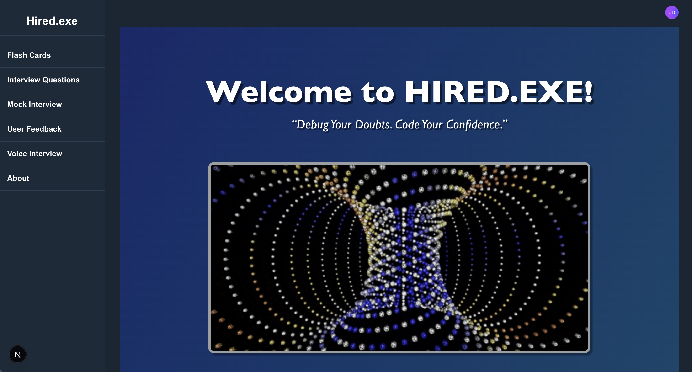

# Decode: Interactive Interview Preparation Platform


[](https://25q1-team2.vercel.app)  
[](LICENSE)

---

## Table of Contents
- [App Description](#app-description)
- [Demo](#demo)
- [Screenshot Gallery](#screenshot-gallery)
- [Motivation](#motivation)
- [Features](#features)
- [Tech Stack](#tech-stack)
- [Getting Started](#getting-started)
- [Usage](#usage)
- [Testing](#testing)
- [Known Issues](#known-issues)
- [Roadmap & Future Features](#roadmap--future-features)
- [Team UNIFY](#team-unify)
- [Contributing](#contributing)
- [License](#license)
- [Acknowledgements](#acknowledgements)

---

## App Description
Decode (formerly **Hired.exe**) is a web‑based quiz application that empowers aspiring programmers and tech professionals to prepare for technical interviews through randomized question sets and AI‑assisted feedback. Users can also create and study custom flashcards to reinforce key concepts before attempting quizzes—combining active recall with practical application for a well‑rounded prep experience.

## Demo
🔗 Live: [https://25q1-team2.vercel.app](https://25q1-team2.vercel.app)

## 📸 Screenshot Gallery

<table>
  <!-- Row 1 -->
  <tr>
    <td align="center" width="50%">
      <br/>
      <strong>Dashboard</strong>
    </td>
    <td align="center" width="50%">
      <br/>
      <strong>Flashcards</strong>
    </td>
  </tr>

  <!-- Row 2 -->
  <tr>
    <td align="center" width="50%">
      <br/>
      <strong>Questions</strong>
    </td>
    <td align="center" width="50%">
      <br/>
      <strong>Mock Interview</strong>
    </td>
  </tr>

  <!-- Row 3 -->
  <tr>
    <td align="center" width="50%">
      <br/>
      <strong>AI Feedback</strong>
    </td>
    <td align="center" width="50%">
      <br/>
      <strong>Voice Interview</strong>
    </td>
  </tr>

  <!-- Row 4 -->
  <tr>
    <td align="center" colspan="2">
      <br/>
      <strong>About</strong>
    </td>
  </tr>
</table>


## Features
- 🔒 Secure auth via Clerk  
- 🃏 Flashcards: create, edit, delete, review  
- 💬 Text interviews: random questions + GPT feedback  
- 🎙️ Voice interviews: record, Whisper‑transcribe, GPT‑evaluate  
- ⭐ STAR‑method scoring & improvement tips  
- 📈 Dashboard: track past sessions & feedback  

---

## Tech Stack

| Layer         | Tech                            |
| ------------- | ------------------------------- |
| Frontend      | Next.js, React, TypeScript      |
| Styling       | CSS Modules                     |
| Backend       | Next.js API Routes, Node.js     |
| ORM & Database| Prisma, PostgreSQL              |
| Auth          | Clerk                           |
| AI Services   | OpenAI API (ChatGPT, Whisper)   |
| Deployment    | Vercel                          |

---

## Getting Started

### Requirements
- Node.js 18+
- npm
- Git
- PostgreSQL DB (local or Prisma Cloud)

### Install & Run

```bash
git clone https://github.com/code-differently/25q1-team2.git
cd 25q1-team2
cp .env.example .env.local
npm install
npm run dev
```

- http://localhost:3000 — App  
- http://localhost:5555 — Prisma Studio

---

## Usage
1. Sign up / log in via Clerk  
2. **Flashcards**: add & review cards  
3. **Mock Interview**: text‑based practice  
4. **Voice Interview**: record & get AI feedback  
5. **History**: revisit past sessions

---

## Testing

### Run Cypress Tests
```bash
npx cypress open       # GUI
npx cypress run        # Headless
```

### View Test Coverage
```bash

npx nyc report --reporter=lcov
open coverage/lcov-report/index.html

```

---

## Known Issues
- [ ] Light/dark mode toggle causes layout shifts  
- [ ] Feedback containers overflow on small screens  
- [ ] Whisper transcription lags on headless Cypress

---

## Roadmap & Future Features
- 📊 Admin panel  
- 🔔 Reminder notifications  
- ⭐ Flashcard scoring  
- 🎮 Concept mini-games  
- 🖼️ Avatars  
- ♿ Accessibility

---

## Team UNIFY

<!-- team section omitted for brevity -->

---

## Contributing
1. Fork  
2. Create branch `git checkout -b feature/MyFeature`  
3. Commit + push  
4. PR to `main`

---

## License
MIT © UNIFY Team

---

## Acknowledgements
- Clerk  
- Prisma  
- OpenAI  
